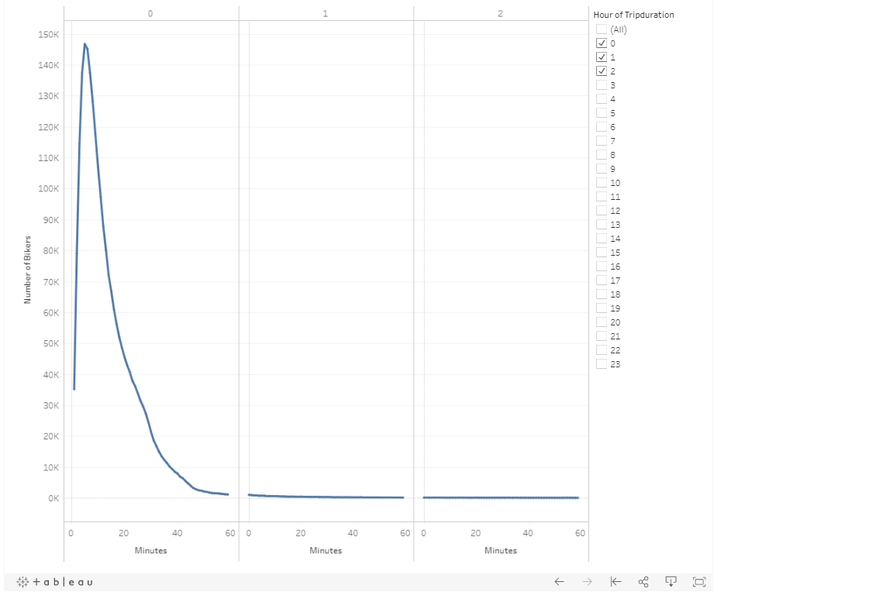
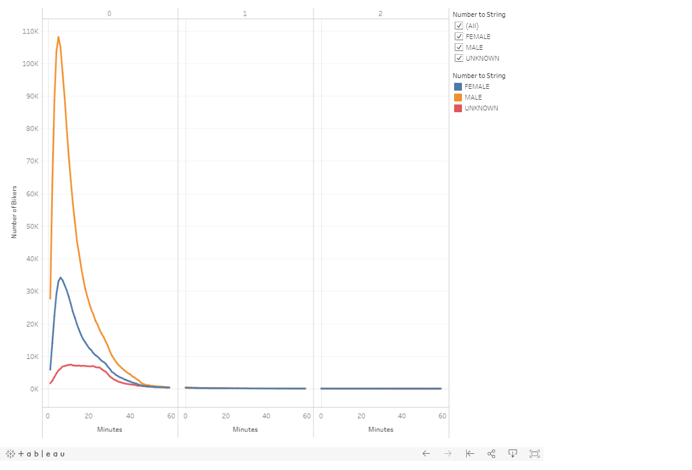
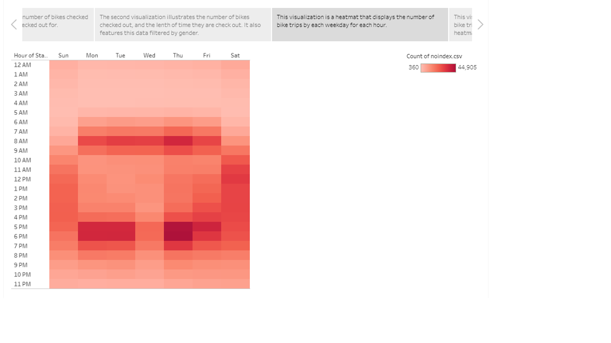
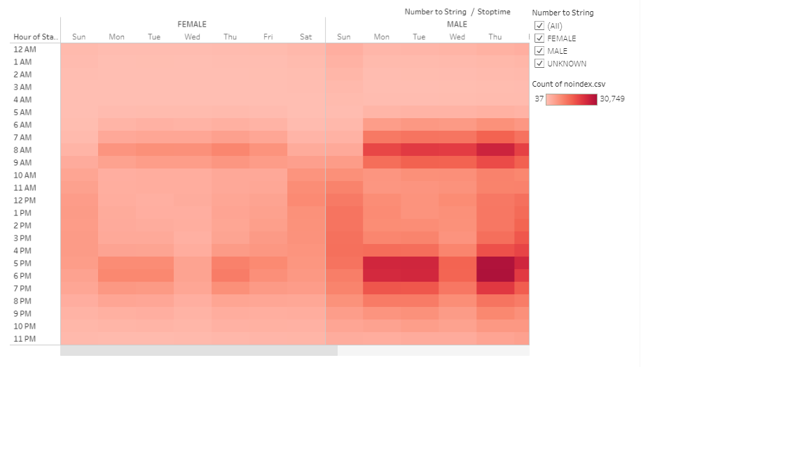
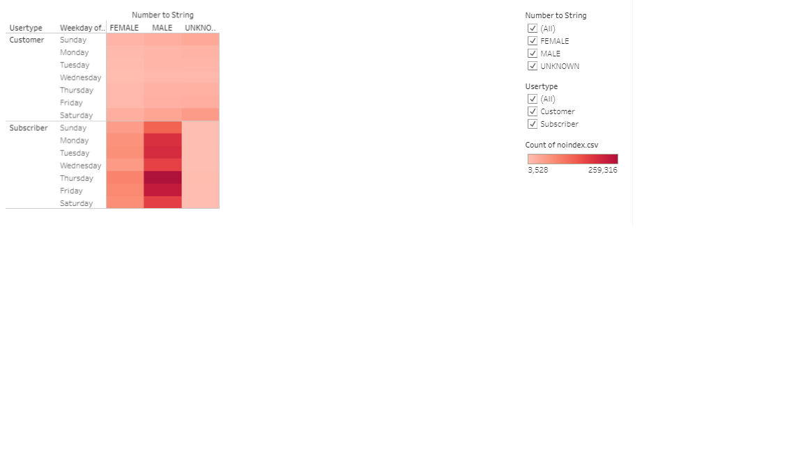

# Bikesharing
## An overview...
This repository uses NYC bike sharing data in order to create a detailed [tableu story](https://public.tableau.com/profile/k.sharma#!/vizhome/Bikesharing_Story/Deliverable) describing the trends and characteristics of the bike sharing program. This data is derived from a csv source, imported through jupyter notebook and pandas, and then presented through tableau. This story will give an insightful presentation on our data, in order to best implement this bike sharing program, and influence decision making.

## Results
These visualizations give us great details about our data. The first and second visualizations show us two major characteristics of our data; most of the user are male, and most bike uses/rides last for no longer than sixty minutes.
The third visualization provides even more detail about the timing of trips taken. It tells us that the peak hours for bike rides are during peak commuting hours, with a peak in the morning from 6am to 9am, and then again in the evening from 4pm until 7pm. This is consistent Monday through to Friday, with the exception of the weekends where bike rides are much more spread out throughout the day. We can also observe that the most trips occur during the evening rush on Thursday.  

The next two visualizations show us once again that male riders are the large majority, and that male subscribers are also the large majority when considering users who are subscribed to this bike program. Finally, our last two visualizations neatly display where rides start, and where they end, on an interactive map.

## In conclusion...
This tableau story has provided the reader with an incredible amount information and presents it in an easy to read way. This data and these visualizations can be used to improve the program and help design future bike sharing programs in other cities. Given that this is in NYC this data is likely to be unique for city users. An immensely helpful comparison would be conducting the same analysis on bike sharing programs in suburban and/or rural communities. The similarities and differences between those analysis and this one would be very insightful when designing programs in the future.

